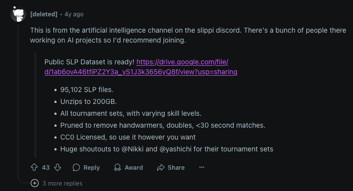

# smash-sim
## Creating and emulating Slippi files
### Set up emulator
* Install Slippi Dolphin emulator from [download](https://slippi.gg/downloads)
* Download melee iso from [Google drive link](https://drive.google.com/drive/u/1/folders/1JYTWe0uDXC9w49NOPqWBP2-KFzlJ0Gqj)
    * Request if you don't have access
* Create a Slippi account and log in on the desktop app
* Provide app with downloaded iso file when prompted
    * If you miss this, go to settings and game tab on left sidebar to load iso

### Set up keyboard controls
* Click the gear icon on the top right of the launcher
* Under Settings/Game, press the “Launch Dolphin” button.
* Back on the home screen, press Play
* In Dolphin:
    - Go to `Controllers` on the top right
    - For Port 1, choose Standard Controller, then click Configure
    - In the popup:
        - Set Device to something like `Keyboard/0/Internal Apple Keyboard...`
        - If it doesn't work when you load the game, you might need some trial and error
* Select and launch the game directly in Dolphin

### Get video frames from .slp replay
* The .slp replay should automatically be saved when you finish the match
* Find the folder where your relevant .slp is saved
* Use [this tool](https://github.com/cbartsch/Slippipedia) to extract .slp to .mp4

## Existing datasets
The Slippi machine learning community already has a 200GB dataset of .slp files that we 
can use ([link here](https://drive.google.com/file/d/1ab6ovA46tfiPZ2Y3a_yS1J3k3656yQ8f/view)).


## Setup
### Instance
Use the AWS AMI from HW4: https://us-west-2.console.aws.amazon.com/ec2/home?region=us-west-2#LaunchInstances:ami=ami-0b9cb966e6b0bdcf8

After setting up an instance, make sure to delete the two pre-existing conda environments to make space.

### CS224R-Smash-Sim Repo
```
conda create -n melee python=3.11
conda activate melee
python -m pip install -r requirements.txt
python -m pip install -e .
pip install "git+https://github.com/vladfi1/libmelee"
```

### Emulator
Get the prebuilt emulator Linux AppImage from vladfi1 here: https://github.com/vladfi1/slippi-Ishiiruka/releases/download/exi-ai-0.1.0/Slippi_Online-x86_64-ExiAI.AppImage 

Run the following to extract the AppImage into binaries in a squashfs-root folder
```
./Slippi_Online-x86_64-ExiAI.AppImage --appimage-extract
```

Get melee.iso and squashfs-root and put them at the root of the directory (i.e. cs224r-smash-sim/)

### Example of running the emulator
Checkout test_melee_env.py

### Example of training
```
python src/scripts/train_melee.py --data_dir=data --exp_name=initial_train
```